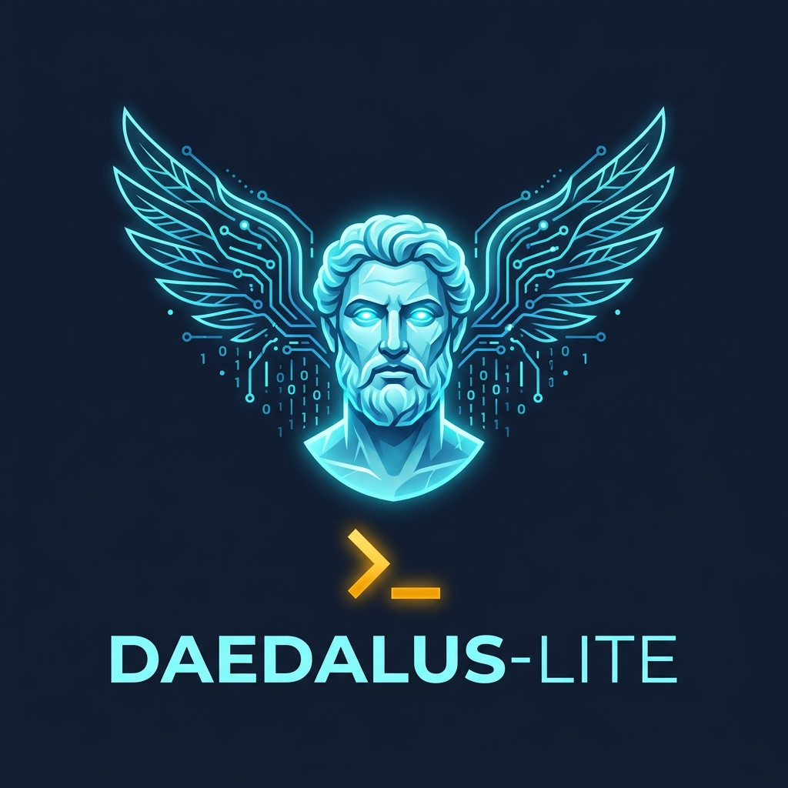


 

 <h1 align="center">Daedalus-Lite</h1>

 <strong>Build your own AI coding assistant. Brand it. Sell it.</strong>   Zero tracking. Zero dependencies. Zero permission.

 
 

 
 <a href="#pricing">Pricing</a> • <a href="#what-you-get">What You Get</a> • <a href="#faq">FAQ</a>

 
    

 --- **Daedalus-Lite** is a lightweight, zero-dependency starter template for building and selling your own branded AI coding assistant. No SaaS fees. No tracking. Just your brand, your code, your price. The actual template code is available in a **private repository** upon purchase. This public repository contains the documentation, marketing, and sales page. --- ## Why not just use ChatGPT? Because you can't resell ChatGPT. You can't put your logo on it. You can't charge $49 for it. Daedalus-Lite gives you the **exact architecture** used by premium AI coding assistants — in-memory router, multi-provider support (OpenAI, Anthropic, local models), and a polished REPL shell — all in ~300 lines of TypeScript with **zero runtime dependencies**. ## What you get | Feature | What it means |
|---------|---------------|
| **InMemory Router** | Routes to OpenAI, Anthropic, or local models (Ollama/LM Studio) with a unified response format |
| **REPL Shell** | Interactive terminal with `/help`, `/model`, `/clear`, `/exit` |
| **Zero Dependencies** | Only `commander` at runtime. That's it. |
| **Local AI Ready** | Works with Ollama, LM Studio — no internet required |
| **Rebrandable** | Change the name, colors, banner — it's yours |
| **Sellable** | MIT + Branded Commercial license. Ship it. | ## How it works 1. Purchase a license (Starter, Pro, or Enterprise)
2. Get access to the **private template repository** containing the full source code
3. Use the template as a starting point — rebrand, modify, and sell your own AI CLI
4. Keep 100% of your profits — no royalties, no subscription fees ## Pricing | Tier | Price | What you get |
|------|-------|-------------|
| **Starter** | $19 | Private GitHub template access + PDF manual + email support |
| **Pro** | $49 | Everything in Starter + pre-compiled binaries + custom theme & banner + priority support |
| **Enterprise** | $249 | Everything in Pro + 1-hour setup call + custom integrations + white-glove onboarding | ## The Pitch > Most AI tooling is SaaS with monthly fees. Daedalus-Lite is a one-time template you own forever. Build your AI CLI this weekend. Ship it under your brand by Monday. --- ## What's Possible with Daedalus-Lite Daedalus-Lite's middleware architecture makes it infinitely extensible. See real-world examples of what you can build: - **Financial Assistant** - Add regulatory compliance and portfolio context
- **Code Review Bot** - Automated PR analysis with security scanning
- **Legal Document Analyzer** - Contract review with structured JSON output
- **Medical Triage Assistant** - Symptom checking with urgency levels
- **Customer Support Agent** - Knowledge base integration and sentiment analysis
- **Language Tutor** - Adaptive learning with grammar correction
- **Data Extraction Pipeline** - Turn unstructured text into validated data
- **Multi-Step Orchestrator** - Chain middleware for logging, auth, rate limiting See the full [What's Possible guide](docs/whats-possible.html) with code examples for each use case. --- 
 <a href="docs/manual/index.html"> Preview the Manual</a> • <a href="https://github.com/bgill55/daedalus-lite-template"> Access the Private Template (after purchase)</a>

 --- ## Introduction Video Watch a quick introduction to Daedalus-Lite: <video width="100%" controls> <source src="docs/manual/daedalus_lite_introduction.mp4" type="video/mp4"> Your browser does not support the video tag.
</video> *See Daedalus-Lite in action and learn how to build your own AI coding assistant business.*