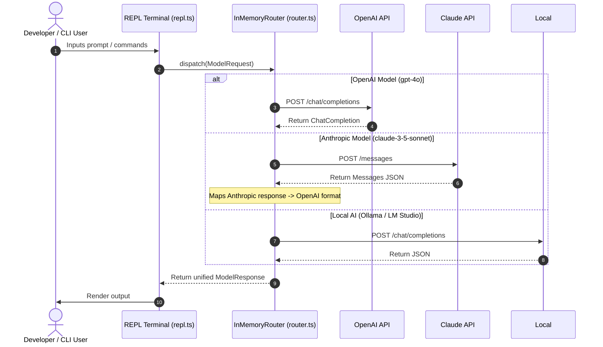

# Daedalus-Lite Launch Kit (Updated with YouTube Video)

Copy-paste ready launch materials for all channels.

---

## 1. Hacker News — **Show HN**
* **URL:** https://news.ycombinator.com/submit
* **Title:** `Show HN: Daedalus-Lite – Local AI Coding Agent Starter Kit in TypeScript`

```markdown
Hi HN! I’m Brian. After spending months building CLI tools, I noticed developers wanting to build their own local AI coding assistants had to wade through heavy frameworks or build complex router abstractions from scratch.

I created **Daedalus-Lite** to solve this. It's a lightweight, opinionated TypeScript starter template designed to help you build, brand, and package your own terminal-based AI pair programmer.

**Watch the 3-Minute Video Walkthrough:**
https://youtu.be/_QJO8mImCug

**What's inside:**
- **InMemory Model Router:** Unified response format for OpenAI (`gpt-4o`, `o1`), Anthropic (`claude-3-5-sonnet`), and Local models (`Ollama` / `LM Studio`).
- **Interactive REPL Shell:** Node readline interface with built-in `/help`, `/model`, `/clear`, and `/exit` commands.
- **Middleware Engine:** Extensible request/response pipeline (logging, prompt manipulation, rate-limiting).
- **Single Runtime Dependency:** Only `dotenv`. Full Jest ESM test suite included.
- **Setup Guide PDF & Infographic:** Comprehensive PDF manual covering rebranding, monetization, and NPM/binary compilation.

**Try the live browser REPL demo (no login needed):**
https://bgill55.github.io/daedalus-lite/live-demo.html

**Gumroad (20% launch discount code `LAUNCH20`):**
https://bgill55dev.gumroad.com/l/mkqrme?offered_code=LAUNCH20

Would love to hear your feedback on the architecture and router design!
```

---

## 2. Reddit — **`r/SideProject` & `r/ArtificialIntelligence`**
* **Title:** `I built Daedalus-Lite: A TypeScript starter template to build your own local AI coding agent in minutes`
* **Media Attachment:** Upload `terminal-demo.gif` as post media + link YouTube video in body.

```markdown
Hey everyone!

I wanted a clean, self-contained way to build and package custom AI coding assistants without pulling in giant frameworks or heavy dependencies.

So I built **Daedalus-Lite** — a production-ready TypeScript starter kit for creating branded AI CLI tools.

🎬 **Watch the 3-Minute YouTube Walkthrough:**
https://youtu.be/_QJO8mImCug

### 🌟 Features:
* **Multi-Model Routing:** Seamlessly switch between OpenAI (`gpt-4o`), Claude (`claude-3-5-sonnet`), and Local AI (`Ollama` / `LM Studio`).
* **Unified API Format:** Anthropic and local responses are automatically mapped to standard OpenAI schema so your frontend logic stays identical.
* **Interactive REPL Terminal:** Readline-based interactive shell with commands (`/help`, `/model`, `/clear`, `/exit`).
* **Extensible Middleware:** Easily add logging, system prompt injection, or token guardrails.
* **Packaging & Monetization:** Includes docs for NPM publishing and compiling to single standalone binary executables (`pkg` / `bun`).

### 🎮 Live Demo & Links:
* **YouTube Walkthrough:** https://youtu.be/_QJO8mImCug
* **Live Interactive Web REPL:** [Try it in your browser](https://bgill55.github.io/daedalus-lite/live-demo.html)
* **GitHub Repository:** [bgill55/daedalus-lite](https://github.com/bgill55/daedalus-lite)
* **Gumroad Template + PDF Manual:** [Get Daedalus-Lite (20% off code: `LAUNCH20`)](https://bgill55dev.gumroad.com/l/mkqrme?offered_code=LAUNCH20)

Happy to answer any questions about the router or setup process!
```

---

## 3. Twitter / X Launch Thread
* **Tip:** Attach `terminal-demo.gif` to **Tweet 1**.

**Tweet 1:**
```text
🚀 Excited to launch Daedalus-Lite!

A lightweight TypeScript starter kit to build, brand, and package your own AI coding assistant in minutes.

Features multi-model routing (OpenAI, Claude, Ollama/LM Studio), interactive REPL, and zero runtime bloat.

🧵 Details & 3-Min Video below 👇
[Attach: terminal-demo.gif]
```

**Tweet 2:**
```text
1/5 ⚡️ Unified Model Router
Switch between OpenAI (gpt-4o), Anthropic (claude-3-5-sonnet), or local models (Ollama/LM Studio). 

Anthropic & local model responses automatically map to a unified schema so your CLI logic never breaks.
```

**Tweet 3:**
```text
2/5 🛠 Extensible Middleware Architecture
Easily inject custom middleware for prompt augmentation, logging, or token guardrails.

Built on Node's native readline — clean, fast, and simple to debug.
```

**Tweet 4:**
```text
3/5 📹 Watch the 3-Minute Video Walkthrough on YouTube:
https://youtu.be/_QJO8mImCug
```

**Tweet 5:**
```text
4/5 🎮 Try the interactive web REPL live in your browser:
https://bgill55.github.io/daedalus-lite/live-demo.html

Get the starter kit + PDF manual with 20% off using code `LAUNCH20`:
https://bgill55dev.gumroad.com/l/mkqrme?offered_code=LAUNCH20
```

---

## 4. Dev.to / Hashnode / Medium Blog Post

```markdown
# How to Build Your Own Branded AI Coding Assistant in TypeScript

AI coding assistants are fast becoming an essential part of every developer's workflow. While tools like Cursor and GitHub Copilot are great, many developers and teams want custom, local, or specialized agents tailored to their private codebases or specific APIs.

In this guide, we'll explore how **Daedalus-Lite** provides a clean TypeScript architecture for building and packaging custom AI CLI agents.

---

## Watch the Video Walkthrough



---

## Architecture Overview

At the heart of any AI CLI is the **Model Router**. It bridges the user's terminal interface with various AI providers.



## Key Highlights

1. **Clean Runtime:** Ships with `dotenv` for env variable loading.
2. **Unified API Abstraction:** Anthropic and local endpoint responses are normalized into a single OpenAI-compatible schema.
3. **Interactive REPL:** Built-in slash commands (`/help`, `/model`, `/clear`, `/exit`).
4. **Offline Local AI:** Seamless out-of-the-box integration with Ollama (`http://localhost:11434/v1`) and LM Studio (`http://localhost:1234/v1`).

---

## Links & Demo

Watch on YouTube:  
👉 [3-Minute Video Walkthrough](https://youtu.be/_QJO8mImCug)

Try the interactive browser REPL demo without installing anything:  
👉 [Live Web REPL Demo](https://bgill55.github.io/daedalus-lite/live-demo.html)

Grab the starter kit & setup manual on Gumroad (Save 20% with code `LAUNCH20`):  
👉 [Daedalus-Lite on Gumroad](https://bgill55dev.gumroad.com/l/mkqrme?offered_code=LAUNCH20)
```